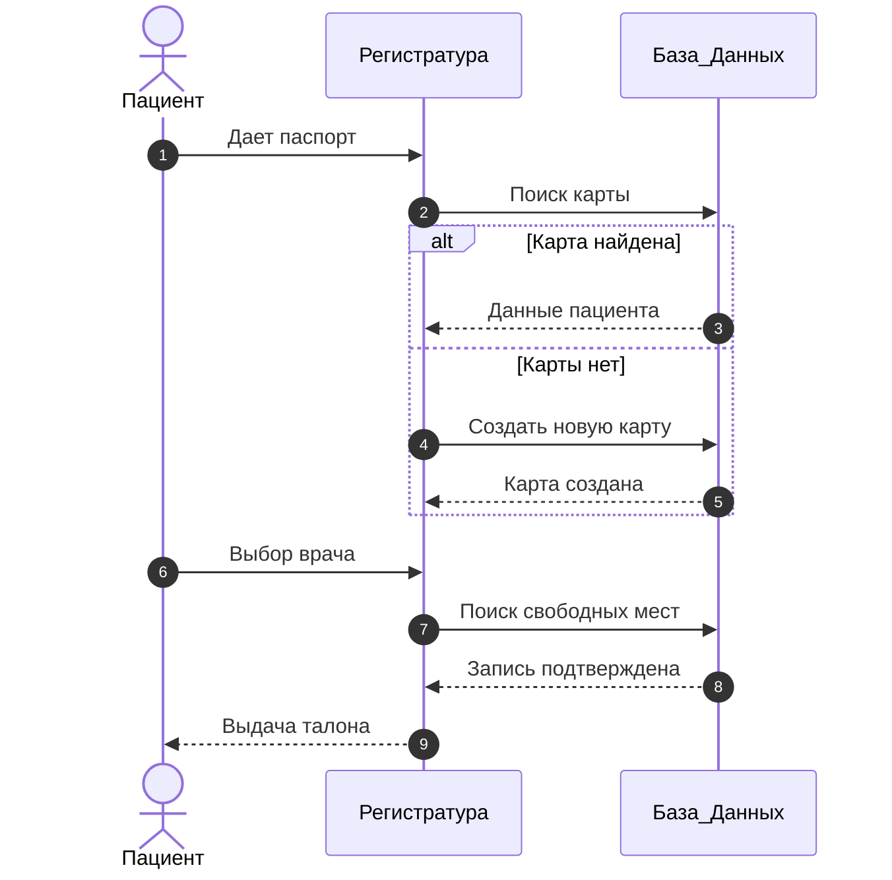

```mermaid
sequenceDiagram
    autonumber
    actor Пациент
    participant Регистратура
    participant База_Данных
    
    Пациент->>Регистратура: Дает паспорт
    Регистратура->>База_Данных: Поиск карты
    alt Карта найдена
        База_Данных-->>Регистратура: Данные пациента
    else Карты нет
        Регистратура->>База_Данных: Создать новую карту
        База_Данных-->>Регистратура: Карта создана
    end
    Пациент->>Регистратура: Выбор врача
    Регистратура->>База_Данных: Поиск свободных мест
    База_Данных-->>Регистратура: Запись подтверждена
    Регистратура-->>Пациент: Выдача талона
```

